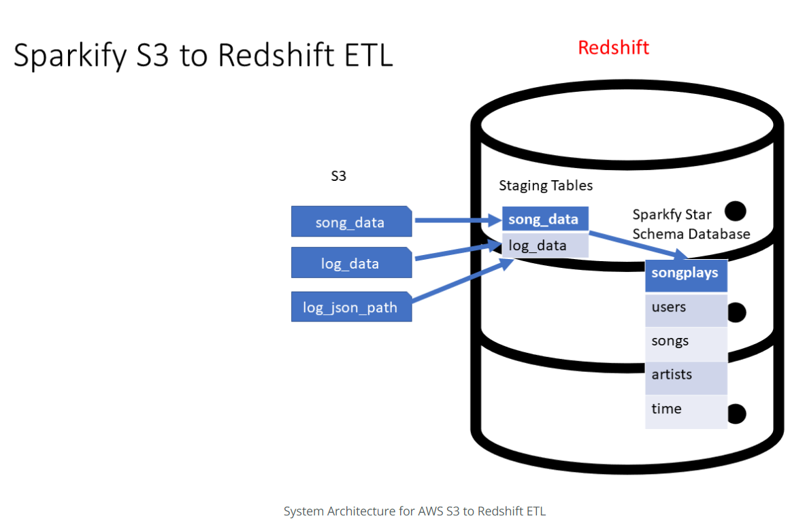

# Project 2: Song Play Analysis with S3 and Redshift
--------------------------

### Introduction

A music streaming startup, Sparkify, has grown their user base and song database and want to move their processes and data onto the cloud. Their data resides in S3, in a directory of JSON logs on user activity on the app, as well as a directory with JSON metadata on the songs in their app.

As their data engineer, you are tasked with building an ETL pipeline that extracts their data from **AWS S3**, stages them in **AWS Redshift**, and transforms data into a set of dimensional tables for their analytics team to continue finding insights into what songs their users are listening to.

### Dataset Description
Datasets for this project are provided in two **S3 buckets**.
One bucket contains infomation for song (songs and artist) and the other bucket contains user log data.

### Database schema design

### Staging Tables

+ _staging_events_: contains information for user activity.

+ _staging_songs_: contains information for song and artist.

### Analytical Tables

+ **Fact Table** 
    - **songplays**: records in event data associated with song plays i.e. records with page NextSong
+ **Dimension Tables** 
    - **users**: Users in the app
    - **songs**: songs in music database
    - **artists**: artists in music database
    - **time**: timestamps of records in **songplays** broken down into specific units

### Project Steps
1. **Create Table Schemas**
- Design schemas for your fact and dimension tables
- Write a SQL CREATE statement for each of these tables in sql_queries.py
- Complete the logic in create_tables.py to connect to the database and create these tables
- Write SQL DROP statements to drop tables in the beginning of - create_tables.py if the tables already exist. This way, you can run create_tables.py whenever you want to reset your database and test your ETL pipeline.
- Launch a redshift cluster and create an IAM role that has read access to S3.
- Add redshift database and IAM role info to dwh.cfg.
- Test by running create_tables.py and checking the table schemas in your redshift database. You can use Query Editor in the AWS Redshift console for this.

2. **Build ETL Pipeline**
- Implement the logic in etl.py to load data from S3 to staging tables on Redshift.
- Implement the logic in etl.py to load data from staging tables to analytics tables on Redshift.
- Test by running etl.py after running create_tables.py and running the analytic queries on your Redshift database to compare your results with the expected results.
- Delete your redshift cluster when finished.

### **Soure Code**

* **src**
     + [create_tables.py] - This file will execute queries in sql_queries.py to to create and delete tables and add data.
     + [etl.py] - This file copy data from s3 to staging table and then create fact and dimension tables.
     + [Project 2] - Cloud Warehouse.ipynb - This file will run ETL pipeline. It also includes adding and cleaning up AWS resources.
     + [sql_queries.py] - This includes all sql queries for ETL pipeline.

### **Important Note**
1. All credentials(Private, access key, etc.) are removed. Need to add values in dhw.cfg. 
2. This Project ran on Udacity Project Workspace.
